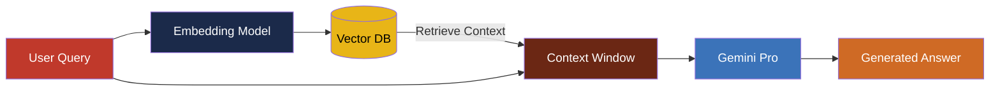

# MLH Gemini RAG Workshop
Building Next-Gen AI Apps with Google Gemini

<div class="pt-12">
  <span @click="$slidev.nav.next" class="px-2 py-1 rounded cursor-pointer" hover="bg-white bg-opacity-10">
    Let's Build <carbon:arrow-right class="inline"/>
  </span>
</div>

---
layout: default
---

# What is RAG?

Retrieval-Augmented Generation (RAG) enhances LLMs by providing external knowledge.

<div class="grid grid-cols-2 gap-4">

<div>

- **Retrieval**: Search relevant documents from a vector database.
- **Augmentation**: Inject retrieved context into the prompt.
- **Generation**: LLM generates an answer based on the context.

</div>

<div class="flex justify-center items-center">
  
</div>

</div>

---
layout: default
---

# Why Gemini?

Gemini is Google's multimodal, long-context LLM.

<v-clicks>

- **Multimodal**: Understands text, images, video, and audio natively.
- **Long Context Window**: Up to 1M tokens (Pro 1.5) allows retrieving large documents.
- **Speed**: Flash models offer high throughput for RAG.
- **Integration**: Seamless with Vertex AI & Google Cloud.

</v-clicks>

---
layout: default
---

# Architecture Diagram

How RAG works under the hood.



---
layout: two-cols
---

# Code Example

Simple RAG with LangChain & Gemini.

::right::

```python {all|3-6|8-12|14-16}
from langchain_google_genai import ChatGoogleGenerativeAI
from langchain.chains import RetrievalQA

# Initialize Gemini
llm = ChatGoogleGenerativeAI(
    model="gemini-1.5-pro",
    temperature=0
)

# Setup Vector Store & Retriever
retriever = vectorstore.as_retriever()
qa_chain = RetrievalQA.from_chain_type(
    llm=llm,
    chain_type="stuff",
    retriever=retriever
)

# Ask Question
response = qa_chain.run("What is MLH?")
print(response)
```

---
layout: center
class: text-center
---

# Live Demo

Let's see it in action!

[Open Demo Link](https://mlh.io)

---
layout: default
---

# Resources

Learn more and start building.

- [MLH Hackathon Guide](https://guide.mlh.io)
- [Google AI Studio](https://aistudio.google.com/)
- [Gemini API Docs](https://ai.google.dev/docs)
- [LangChain Google Integration](https://python.langchain.com/docs/integrations/chat/google_generative_ai/)

---
layout: end
---

# Q&A

Thank You!

[mlh.io](https://mlh.io)
